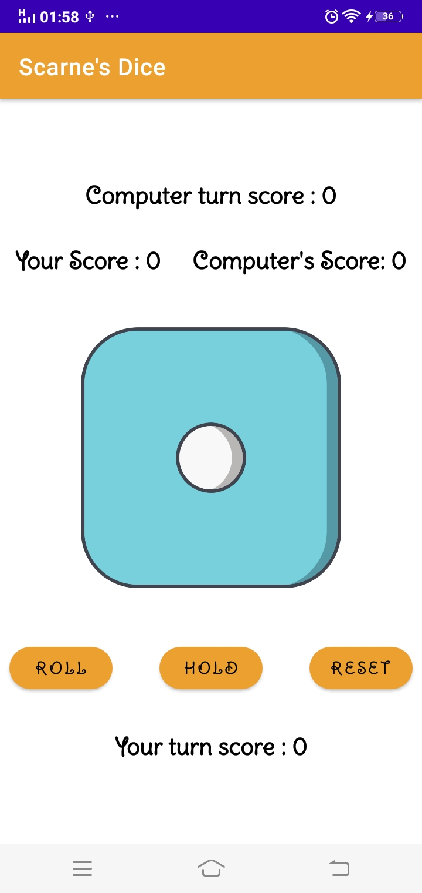
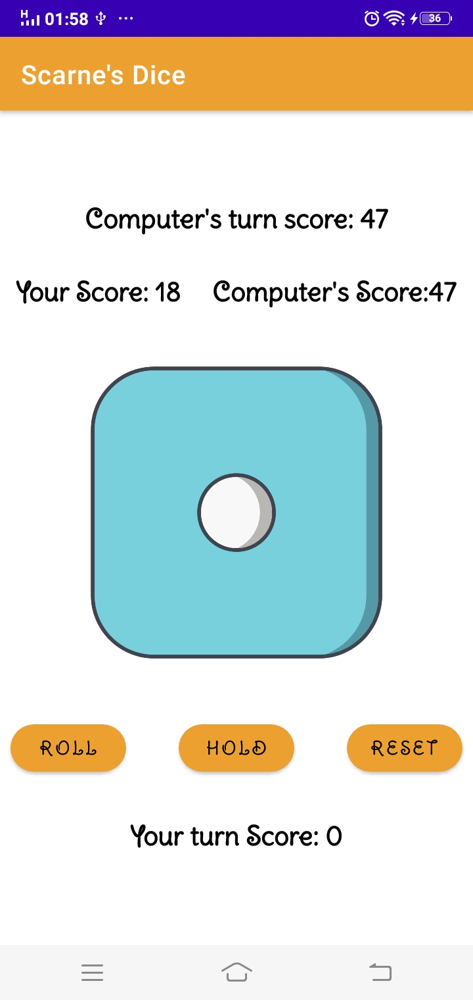
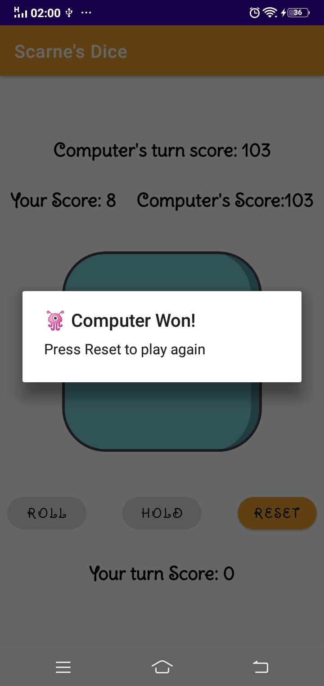
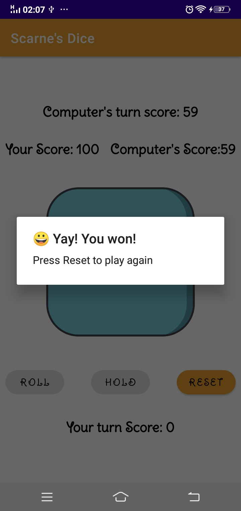

# Scarne-Dice-Game

Scarne’s Dice is a turn-based dice game where players score points against the bot(computer) by rolling a die and then:
------------------------------------------------------------
* If they roll a 1, they score no points and lose their turn.
* If they roll a 2 to 6:
  * Add the rolled value to their points
  * Choose to either re-roll or keep their score and end their turn, in which case it will be computer's turn to do so.
  
  The winner is the first player that reaches (or exceeds) 100 points.
 
|  |  | |  |
|---|---|---|---|
